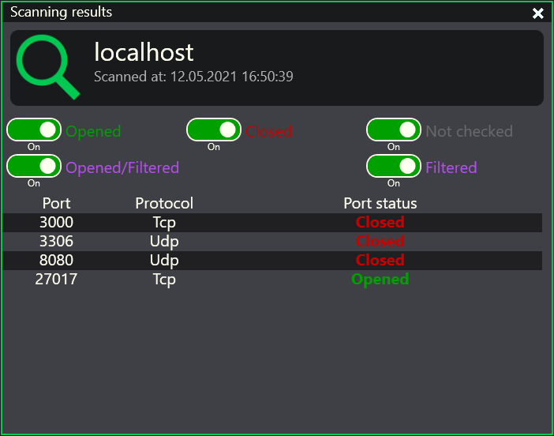
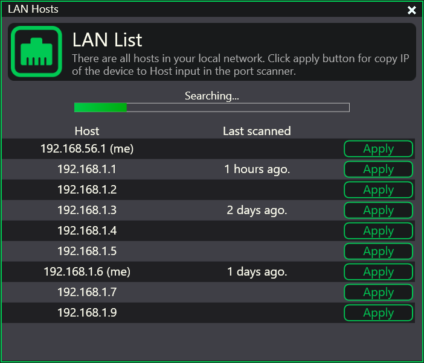

<h1 style="text-align:center">Looto - port scanner</h1>

Looto - multi-thread port scanner with powerful user-friendly GUI. Port scanning can be the first step in a hacking or hacking prevention process, helping to identify potential targets for an attack. Scan your network to be sure you are safe. This software can use ONLY for educational purposes or for protection purposes! This software scanning needed ports via sockets, that sends pakcages to this ports. The adventage of this software is that it has a GUI and that can signficantly speed up the work. Speed of scanning depends on cores count of your processor.

 
 

## ⚡ Interface

### 🔧 Main window
Main window contains all inputs for settings scanning. Theese are inputs such as host for scanning and various settings to select required ports. You can choose your ports separately or choose the range of scanning ports. You can enter ports separately for each protocol or for all protocols at once.

While the scan is in progress, you can see the progress bar.

---
 

### ✔️ Scan result
After scanning you will see the scan result in an understandable form.

---
 

### 🔍 LAN List
Scan your local network and get all devices IP in LAN. For convenience you can copy IP address from list to scan window with "Apply" button.

---
 

### ❌ Error handling
If error was occured in theory app will not crash. It will show window about crash, then will write logs entries with EXCP type with creating bug report. You can write new issue as bug report [here](https://github.com/DES-Destry/Looto/issues/new?assignees=DES-Destry&labels=bug&template=bug_report.md&title=Looto+have+a+bug%21). For more informative of the bug you can send ".data" folder content to agafonovandrej69@gmail.com. I'll not check your ".data" folder without created issue!

---
 
 

## 📜Install
Lastest stable version of application will be available in [Releases](https://github.com/DES-Destry/Looto/releases) of [GitHub repository](https://github.com/DES-Destry/Looto). For stable working of application you need only one executable file (Looto.exe) and ".data" folder. Other files not necessary for application working, but still important.

 
 

## 🔜 Coming soon...
- At the moment this soft a little unfinished, but all mistakes will be fixed in the next versions of software.
- Optimize memory using in port results render. If ports count is 65534 in result, then app uses ~1.2GB of RAM.
- Make application flexible configurable with settings page.
- Allow the user to save the results to files of vaious types.
- Make application update system to ensure that the user always only has the latest version of app.
- Check ports on "Filtered" state.