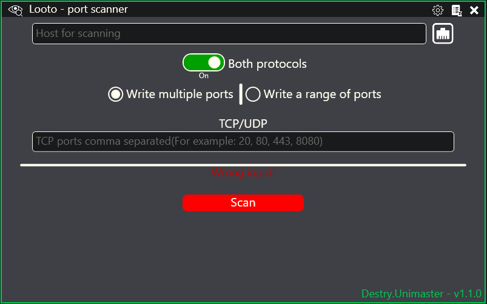

<h1 style="text-align:center">Looto - port scanner</h1>

Looto - port scanner with powerful user-friendly GUI. Port scanning can be the first step in a hacking or hacking prevention process, helping to identify potential targets for an attack. Scan your network to be sure you are safe. This software can use ONLY for educational purposes or for protection purposes! This software scanning needed ports via sockets, that sends pakcages to this ports. The adventage of this software is that it has a GUI and that can signficantly speed up the work.

 
 

## ⚡ Interface

### 🔧 Main window
Main window contains all inputs for settings scanning. Theese are inputs such as host for scanning and various settings to select required ports. You can choose your ports separately or choose the range of scanning ports. You can enter ports separately for each protocol or for all protocols at once.

While the scan is in progress, you can see the progress bar.

---
 

### ✔️ Scan result
After scanning you will see the scan result in an understandable form.

---
 
 

## 📜Install
Lastest stable version of application will be available in [Releases](https://github.com/DES-Destry/Looto/releases) of [GitHub repository](https://github.com/DES-Destry/Looto). For stable working of application you need only one executable file (Looto.exe), other files not necessary for application working, but still important.

 
 

## 🔜 Coming soon...
- At the moment this soft a little unfinished, but all mistakes will be fixed in the next versions of software.
